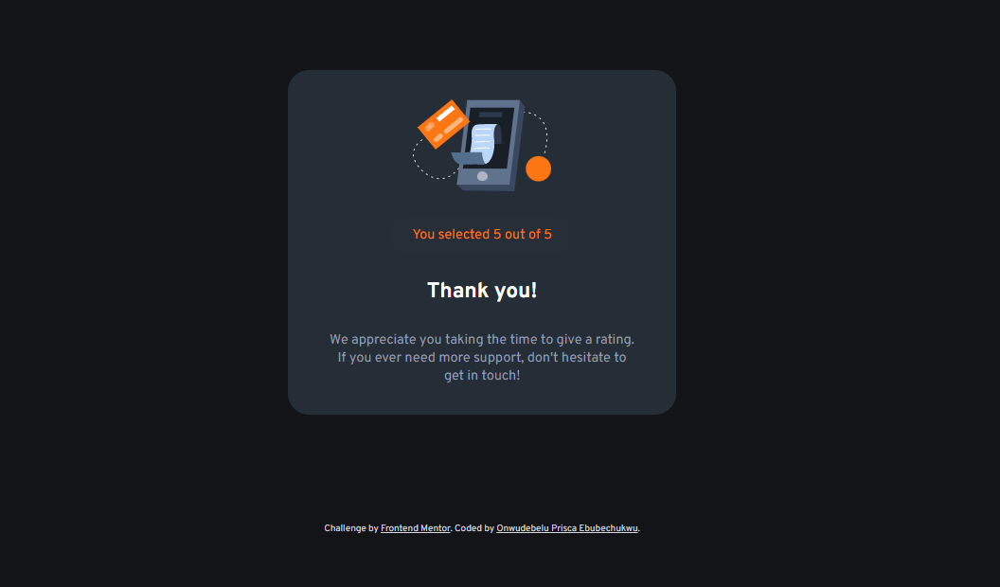

# Frontend Mentor - Interactive rating component solution

This is a solution to the [Interactive rating component challenge on Frontend Mentor](https://www.frontendmentor.io/challenges/interactive-rating-component-koxpeBUmI). Frontend Mentor challenges help you improve your coding skills by building realistic projects. 

## Table of contents

- [Overview](#overview)
  - [The challenge](#the-challenge)
  - [Screenshot](#screenshot)
  - [Links](#links)
- [My process](#my-process)
  - [Built with](#built-with)
  - [What I learned](#what-i-learned)
  - [Continued development](#continued-development)
  - [Useful resources](#useful-resources)
- [Author](#author)
- [Acknowledgments](#acknowledgments)

## Overview

### The challenge

Users should be able to:

- View the optimal layout for the app depending on their device's screen size
- See hover states for all interactive elements on the page
- Select and submit a number rating
- See the "Thank you" card state after submitting a rating

### Screenshot

### Links

- Solution URL: [ solution URL here](https://github.com/PriscaTonia/rating-component-6)
- Live Site URL: [ live site URL here](https://rating-component-6.vercel.app/)

## My process

### Built with

- Semantic HTML5 markup
- CSS custom properties
- Flexbox
- Desktop-first workflow

### What I learned

I learnt about using css flex properties to better make my code responsive and reduce css styles that were written. I also got to practice Javascript DOM manipulation to add event listeners and change up my styles.

### Continued development

I would love to continue learning more css flexibility and awesome styles, as well as practice more javascripts codes. And hopefully, learn and effectively use JavaScript frame works.

## Author

- Website - [Onwudebelu Prisca Ebubechuwku](N/A)
- Frontend Mentor - [@PriscaTonia](https://www.frontendmentor.io/profile/PriscaTonia)
- Twitter - [@EbubePrisca](https://twitter.com/EbubePrisca)
- Instagram - [@prisca_ebube](https://www.instagram.com/prisca_ebube/)

